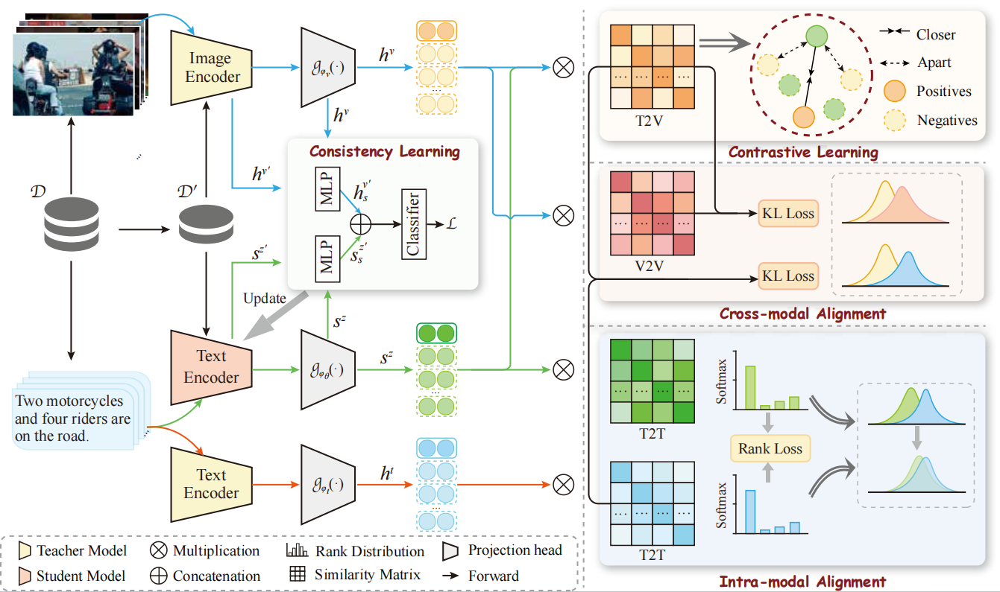

[English](README.md) | [中文](README_zh.md)

# DALR

[](LICENSE)
[](https://www.python.org/)
[](CONTRIBUTING.md)

## Overview

We propose **DALR** (**D**ual-level **A**lignment **L**earning for multimodal sentence **R**epresentation Learning).

To achieve cross-modal fine-grained alignment, we propose a cross-modal alignment method to mitigate the *cross-modal misalignment bias* (CMB) issue. To alleviate the *intra-modal semantic divergence* (ISD) issue, we integrate ranking distillation with global alignment learning to effectively align intra-modal representations.

The figure below illustrates the overall model architecture.



---

## Table of Contents

- [Getting Started](#getting-started)
  - [Environment Setup](#environment-setup)
  - [Download Datasets](#download-datasets)
- [Quick Start: Use DALR](#quick-start-use-dalr)
- [Evaluation](#evaluation)
- [Train Your Own Models](#train-your-own-models)
- [Project Structure](#project-structure)
- [Citation](#citation)
- [Acknowledgements](#acknowledgements)
- [Contributing](#contributing)

---

## Getting Started

### Environment Setup

We recommend creating a virtual environment first:

```bash
python -m venv venv
source venv/bin/activate  # Windows: venv\Scripts\activate
```

Install PyTorch (CUDA 11.1):

```bash
pip install torch==1.8.1+cu111 torchvision==0.9.1+cu111 torchaudio==0.8.1 \
    -f https://download.pytorch.org/whl/torch_stable.html
```

For CUDA < 11 or CPU-only:

```bash
pip install torch==1.8.1
```

Then install the remaining dependencies:

```bash
pip install -r requirements.txt
```

### Download Datasets

Download Flickr30k and MS-COCO from their official websites and organize them as follows:

```
REPO ROOT
├── data
│   ├── Flickr/
│   ├── MS-COCO/
│   └── wiki1m_for_simcse.txt
├── Model/
│   ├── bert-base-uncased/
│   ├── simcse/
│   ├── DiffCSE/
│   └── clip/
│       └── ViT-L-14.pt
```

**Wiki1M** (used for text training):

```bash
wget https://huggingface.co/datasets/princeton-nlp/datasets-for-simcse/resolve/main/wiki1m_for_simcse.txt \
    -P data/
```

**SentEval evaluation datasets** (from [SimCSE](https://github.com/princeton-nlp/SimCSE)):

```bash
cd SentEval/data/downstream/
bash download_dataset.sh
```

Pretrained models (SimCSE, DiffCSE, BERT-base, CLIP ViT-L/14) can be downloaded from [Hugging Face](https://huggingface.co/) and placed in the `Model/` directory.

---

## Quick Start: Use DALR

```python
import torch
from scipy.spatial.distance import cosine
from transformers import AutoModel, AutoTokenizer

tokenizer = AutoTokenizer.from_pretrained("Model/DALR")
model = AutoModel.from_pretrained("Model/DALR")

texts = [
    "There's a kid on a skateboard.",
    "A kid is skateboarding.",
    "A kid is inside the house.",
]
inputs = tokenizer(texts, padding=True, truncation=True, return_tensors="pt")

with torch.no_grad():
    embeddings = model(**inputs, output_hidden_states=True, return_dict=True).pooler_output

cosine_sim_0_1 = 1 - cosine(embeddings[0], embeddings[1])
cosine_sim_0_2 = 1 - cosine(embeddings[0], embeddings[2])

print("Cosine similarity between \"%s\" and \"%s\" is: %.3f" % (texts[0], texts[1], cosine_sim_0_1))
print("Cosine similarity between \"%s\" and \"%s\" is: %.3f" % (texts[0], texts[2], cosine_sim_0_2))
```

---

## Evaluation

Run evaluation on SentEval benchmarks:

```bash
python src/evaluation.py \
    --model_name_or_path Model/DALR \
    --pooler cls_before_pooler \
    --task_set sts \
    --mode test
```

Additional evaluation scripts are provided in `scripts/`:

```bash
bash scripts/run_eval.sh        # STS evaluation
bash scripts/run_eval_coco.sh   # COCO retrieval evaluation
```

---

## Train Your Own Models

### Wiki + Flickr30k

```bash
bash scripts/run_wiki_flickr.sh
```

### Wiki + MS-COCO

```bash
bash scripts/run_wiki_coco.sh
```

You can freely adjust hyperparameters (learning rate, batch size, margins, lambda, etc.) in the respective shell scripts. Key arguments:

| Argument | Description | Default |
|---|---|---|
| `--framework` | Training framework (`simcse` / `mse`) | `mse` |
| `--learning_rate` | Learning rate | `2e-5` |
| `--per_device_train_batch_size` | Batch size per device | `128` |
| `--num_train_epochs` | Number of training epochs | `4` |
| `--lbd` | Weight for distillation loss | `0.01` |
| `--margin1` / `--margin2` | Ranking margins | `0.18` |
| `--distillation_loss` | Distillation loss type | `listmle` |
| `--alpha_` / `--beta_` / `--gamma_` | Loss weights | `0.33 / 1.0 / 1.0` |

---

## Project Structure

```
DALR/
├── clip/                   # CLIP model utilities
├── data/                   # Data directory (datasets downloaded here)
├── figure/                 # Figures used in the paper / README
├── scripts/                # Training and evaluation shell scripts
│   ├── run_wiki_flickr.sh
│   ├── run_wiki_coco.sh
│   ├── run_eval.sh
│   └── run_eval_coco.sh
├── SentEval/               # SentEval toolkit (evaluation)
├── src/                    # Core source code
│   ├── model_dalr.py       # DALR model definition
│   ├── train_mix.py        # Main training script
│   ├── data.py             # Dataset and data loading
│   ├── evaluation.py       # SentEval evaluation
│   ├── teachers.py         # Teacher model wrappers
│   ├── utils.py            # Utility functions
│   ├── vit.py              # Vision Transformer implementation
│   ├── xbert.py            # Extended BERT utilities
│   ├── tool.py             # Miscellaneous tools
│   └── randaugment.py      # RandAugment data augmentation
├── requirements.txt
├── LICENSE
├── CONTRIBUTING.md
└── README.md
```

---

## Citation

If you find this work useful in your research, please consider citing:

```bibtex
@inproceedings{he-etal-2025-dalr,
    title = "{DALR}: Dual-level Alignment Learning for Multimodal Sentence Representation Learning",
    author = "He, Kang  and
      Ding, Yuzhe  and
      Wang, Haining  and
      Li, Fei  and
      Teng, Chong  and
      Ji, Donghong",
    booktitle = "Findings of the Association for Computational Linguistics: ACL 2025",
    year = "2025",
    pages = "3586--3601",   
}
```

> Note: Please update the citation with the actual paper details once published.

---

## Acknowledgements

- Evaluation is powered by the [SentEval toolkit](https://github.com/facebookresearch/SentEval); we adopt the modified version from [SimCSE](https://github.com/princeton-nlp/SimCSE).
- Part of our code is adapted from [MCSE](https://github.com/uds-lsv/MCSE) and [KDMCSE](https://github.com/duyngtr16061999/KDMCSE).

---

## Contributing

We welcome contributions! Please read our [Contributing Guide](CONTRIBUTING.md) to get started. Feel free to open an [Issue](https://github.com/kangverse/DALR/issues) or submit a [Pull Request](https://github.com/kangverse/DALR/pulls).
